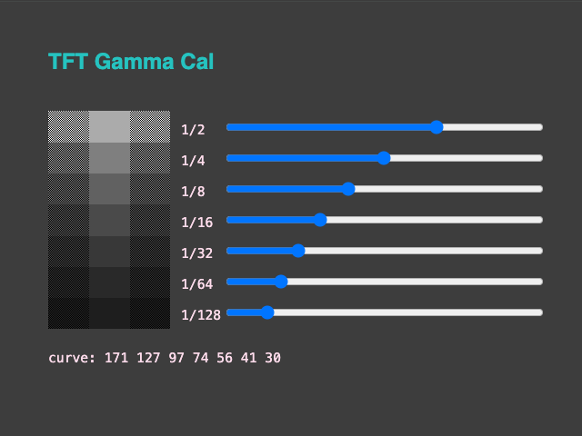

<!-- SPDX-License-Identifier: MIT -->
<!-- SPDX-FileCopyrightText: Copyright 2024 Sam Blenny -->
# TFT Gamma Calibrator

**WORK IN PROGRESS (ALPHA)**

The screenshot below shows an interactive test pattern from the html/js web
version of my gamma curve checker. I'm using this as a baseline reference for
what should happen on a color managed display.

This curve was calibrated on a color managed monitor set for the sRGB
IEC61966-2.1 color profile. On other sRGB color managed monitors, the
brightness of the 7 vertically stacked gray bars should look consistent from
left to right. For displays using some other color profile, the middle third of
each bar may appear to have a different brightness value compared to the left
and right ends. The effect only works when the image is viewed at 100% scaling.

## Hardware

### Parts

- Adafruit ESP32-S3 TFT Feather - 4MB Flash, 2MB PSRAM
  ([product page](https://www.adafruit.com/product/5483),
  [learn guide](https://learn.adafruit.com/adafruit-esp32-s3-tft-feather))

### Pinouts

| TFT feather | ST7789 TFT |
| ----------- | ---------- |
|  SCK        |  SCK       |
|  MOSI       |  MOSI      |
|  MISO       |  MISO      |
|  TFT_CS     |  CS        |
|  TFT_DC     |  DC        |

## Updating CircuitPython

**NOTE: To update CircuitPython on the ESP32-S3 TFT Feather with 2MB PSRAM and
4MB Flash, you need to use the .BIN file (combination bootloader and
CircuitPython core)**

1. Download the CircuitPython 9.1.4 **.BIN** file from the
   [Feather ESP32-S3 TFT PSRAM](https://circuitpython.org/board/adafruit_feather_esp32s3_tft/)
   page on circuitpython.org

2. Follow the instructions in the
   [Web Serial ESPTool](https://learn.adafruit.com/circuitpython-with-esp32-quick-start/web-serial-esptool)
   section of the "CircuitPython on ESP32 Quick Start" learn guide to update
   your board: first erase the flash, then program the .BIN file.

## Installing CircuitPython Code

To copy the project bundle files to your CIRCUITPY drive:

1. Download the project bundle .zip file using the button on the Playground
   guide or the attachment download link on the GitHub repo Releases page.

2. Expand the zip file by opening it, or use `unzip` in a Terminal. The zip
   archive should expand to a folder. When you open the folder, it should
   contain a `README.txt` file and a `CircuitPython 9.x` folder.

3. Open the CircuitPython 9.x folder and copy all of its contents to your
   CIRCUITPY drive.

To learn more about copying libraries to your CIRCUITPY drive, check out the
[CircuitPython Libraries](https://learn.adafruit.com/welcome-to-circuitpython/circuitpython-libraries)
section of the
[Welcome to CircuitPython!](https://learn.adafruit.com/welcome-to-circuitpython)
learn guide.
