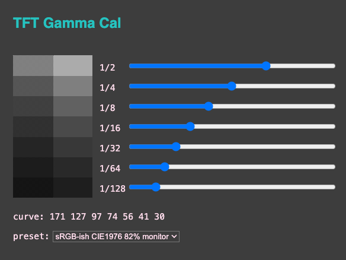
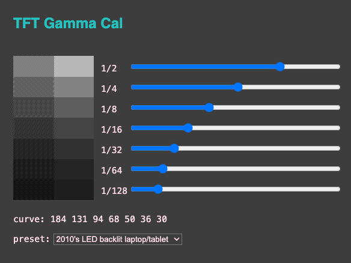
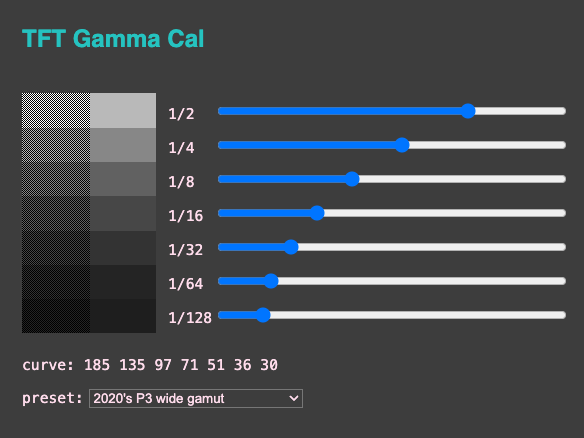
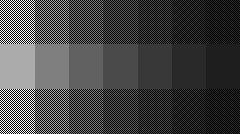

<!-- SPDX-License-Identifier: MIT -->
<!-- SPDX-FileCopyrightText: Copyright 2024 Sam Blenny -->
# TFT Gamma Calibrator

**WORK IN PROGRESS (ALPHA)**

The screenshots below show test patterns from an interactive gamma curve
checker web tool. These can be used to compare gamma responses between
displays, which is a useful proxy for the more difficult task of comparing
color gamuts.

For each of the 7 gray bars in the test pattern, the left half is a
checkerboard dither pattern while the right half is a solid color. When your
display's gamma response matches the gamma curve defined by the slider values,
the gray bars should appear equally bright from left to right. On a display
with some other gamma response, the left and right halves won't match.

This curve is for an LED backlit Dell monitor that I attempted to configure for
displaying colors as sRGB. The monitor specs say it has a CIE1976 82% gamut,
which, as best I can tell, is approximately the full sRGB gamut. The table
below shows how I configured macOS and the monitor in my attempt to turn off
features that would skew color reproduction away from sRGB.

| Device  | Setting                           | Value             |
| ------- | --------------------------------- | ----------------- |
| mac     | Displays &gt; Color profile       | sRGB IEC61966-2.1 |
| monitor | Brightness                        | 20%               |
|         | Contrast                          | 100%              |
|         | Display Settings &gt; Sharpness   | 50%               |
|         | Color Settings &gt; Image Enhance | Off               |
|         | Color Settings &gt; Preset Modes  | Standard          |

### Curve for 2010's Tablets/Laptops

This curve uses slider values averaged from some mid-2010 good quality LED
backlit tablet and laptop displays, configured to use their default color
profiles.

### Curve for 2020's P3 Wide Gamut

This curve uses slider values averaged from some 2020's devices with P3 wide
gamut displays, configured to use their default color profiles.

### Test PNG (web style)

This is a cropped and rotated version of the screenshot above, but I removed
the embedded ICC profile from the PNG file. PNG files are often prepared this
way to match how some popular web browsers render CSS colors.

### Test PNG with Embedded Color Profile

This is a cropped and rotated version of the screenshot above, and it includes
an embedded sRGB color profile. Some software may not display PNG files as sRGB
unless there is an embedded ICC color profile. It might be interesting to see
if this image looks the same as the previous image that lacks the embedded
color profile.

## Hardware

### Parts

- Adafruit ESP32-S3 TFT Feather - 4MB Flash, 2MB PSRAM
  ([product page](https://www.adafruit.com/product/5483),
  [learn guide](https://learn.adafruit.com/adafruit-esp32-s3-tft-feather))

### Pinouts

| TFT feather | ST7789 TFT |
| ----------- | ---------- |
|  SCK        |  SCK       |
|  MOSI       |  MOSI      |
|  MISO       |  MISO      |
|  TFT_CS     |  CS        |
|  TFT_DC     |  DC        |

## Updating CircuitPython

**NOTE: To update CircuitPython on the ESP32-S3 TFT Feather with 2MB PSRAM and
4MB Flash, you need to use the .BIN file (combination bootloader and
CircuitPython core)**

1. Download the CircuitPython 9.1.4 **.BIN** file from the
   [Feather ESP32-S3 TFT PSRAM](https://circuitpython.org/board/adafruit_feather_esp32s3_tft/)
   page on circuitpython.org

2. Follow the instructions in the
   [Web Serial ESPTool](https://learn.adafruit.com/circuitpython-with-esp32-quick-start/web-serial-esptool)
   section of the "CircuitPython on ESP32 Quick Start" learn guide to update
   your board: first erase the flash, then program the .BIN file.

## Installing CircuitPython Code

To copy the project bundle files to your CIRCUITPY drive:

1. Download the project bundle .zip file using the button on the Playground
   guide or the attachment download link on the GitHub repo Releases page.

2. Expand the zip file by opening it, or use `unzip` in a Terminal. The zip
   archive should expand to a folder. When you open the folder, it should
   contain a `README.txt` file and a `CircuitPython 9.x` folder.

3. Open the CircuitPython 9.x folder and copy all of its contents to your
   CIRCUITPY drive.

To learn more about copying libraries to your CIRCUITPY drive, check out the
[CircuitPython Libraries](https://learn.adafruit.com/welcome-to-circuitpython/circuitpython-libraries)
section of the
[Welcome to CircuitPython!](https://learn.adafruit.com/welcome-to-circuitpython)
learn guide.
